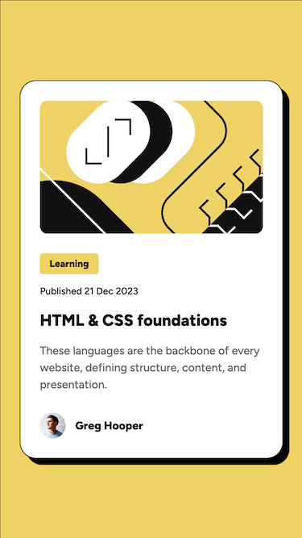
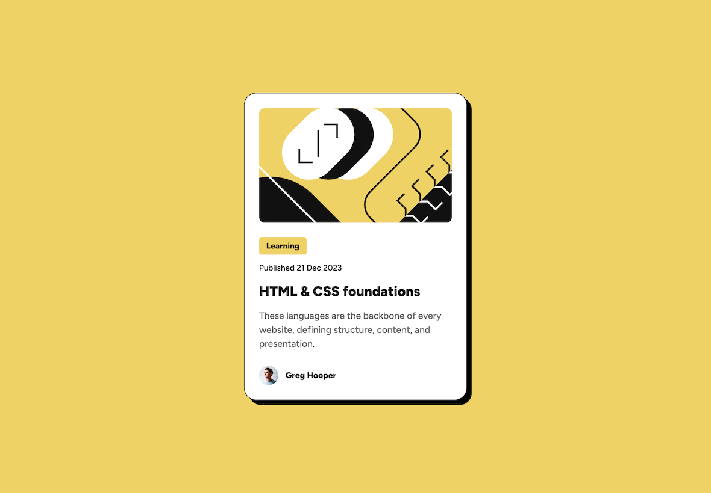
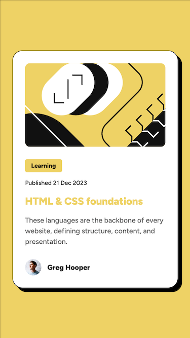
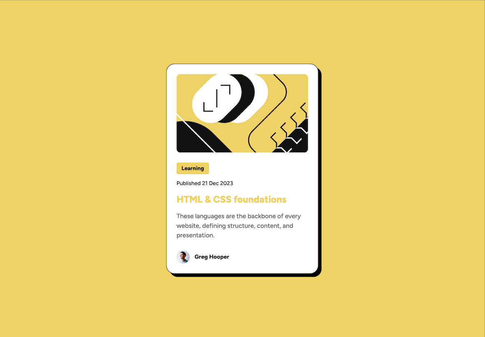

# Frontend Mentor - Blog preview card solution

This is a solution to the [Blog preview card challenge on Frontend Mentor](https://www.frontendmentor.io/challenges/blog-preview-card-ckPaj01IcS).

## Table of contents

- [Frontend Mentor - Blog preview card solution](#frontend-mentor---blog-preview-card-solution)
  - [Table of contents](#table-of-contents)
  - [Overview](#overview)
    - [The challenge](#the-challenge)
    - [Screenshot](#screenshot)
      - [Normal states](#normal-states)
      - [Active states](#active-states)
    - [Links](#links)
  - [My process](#my-process)
    - [Built with](#built-with)
    - [What I learned](#what-i-learned)
    - [Useful resources](#useful-resources)
  - [Author](#author)

## Overview

### The challenge

Users should be able to:

- See hover and focus states for all interactive elements on the page

### Screenshot

#### Normal states

#### Active states

### Links

- Solution URL: [https://github.com/chiaminchen/blog-preview-card](https://github.com/chiaminchen/blog-preview-card)
- Live Site URL: [https://chiaminchen.github.io/blog-preview-card/](https://chiaminchen.github.io/blog-preview-card/)

## My process

### Built with

- Semantic HTML5 markup
- CSS custom properties
- Flexbox

### What I learned

Using CSS function `clamp()` to create more responsive and flexible layouts that adapt to different viewport sizes.

### Useful resources

- [MDN](https://developer.mozilla.org/en-US/docs/Web/CSS/Reference/Values/clamp)
- [CSS TRICKS](https://css-tricks.com/almanac/functions/c/clamp/)

## Author

- Website - [https://github.com/chiaminchen](https://github.com/chiaminchen)
- Frontend Mentor - [@chiaminchen](https://www.frontendmentor.io/profile/chiaminchen)
